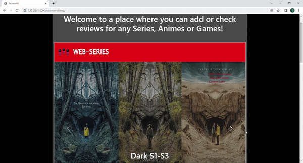

# Review4U

  

  <h4 align="center">Rating Website build with Django</h4>

   <a href="https://github.com/SourabHere/Review4U/issues">Report Bug</a>
  

## About the project 

* Review4U can be used to rate anime,games and webseries.
* You can check reviews of anime/webseries/games next on your list.

  

## Languages used

* Django
* HTML
* CSS
* JavaScript
* Bootstrap

## Libraries

* <a href="https://docs.djangoproject.com/en/4.0/ref/urls/">Path</a>
* <a href="https://docs.djangoproject.com/en/4.0/topics/db/models/">Models</a>

## Contributing

Contributions are what make the open source community such an amazing place to learn, inspire, and create. Any contributions you make are **greatly appreciated**.

If you have a suggestion that would make this better, please fork the repo and create a pull request. You can also simply open an issue with the tag "enhancement" or "feature".
Don't forget to give the project a star!

1. Fork the Project
2. Create your Feature Branch (`git checkout -b feature/AmazingFeature`)
3. Commit your Changes (`git commit -m 'Add some AmazingFeature'`)
4. Push to the Branch (`git push origin feature/AmazingFeature`)
5. Open a Pull Request
